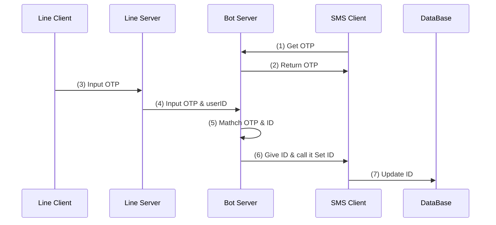

刪除好友範例
```json
{
  destination: 'U6e6c2a866a0d3b4eea5ebdad75d331ca',
  events: [
    {
      type: 'unfollow',
      webhookEventId: '01JKWQ3GK90900VF6KQ4H34BB1',
      deliveryContext: [Object],
      timestamp: 1739351769450,
      source: [Object],
      mode: 'active'
    }
  ]
}
```


加好友範例
```json
 {
  destination: 'U6e6c2a866a0d3b4eea5ebdad75d331ca',
  events: [
    {
      type: 'follow',
      follow: [Object],
      webhookEventId: '01JKWQ8XP9VW96PBFVDV7BA2H4',
      deliveryContext: [Object],
      timestamp: 1739351946436,
      source: [Object],
      replyToken: '1a89070e70b74f319bcf29d613a8ad8f',
      mode: 'active'
    }
  ]
}
```